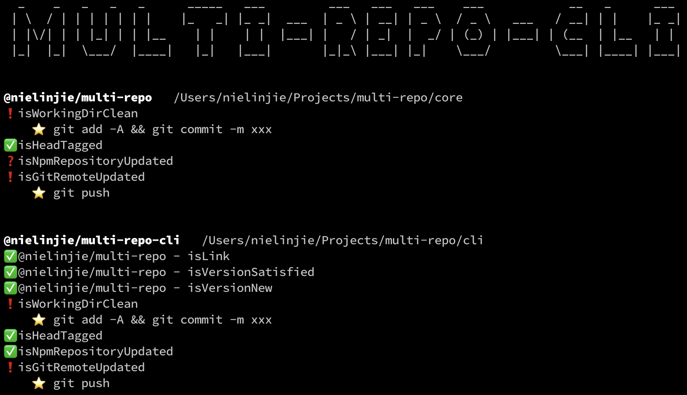

# multi-repo-cli

multi-repo的默认 UI，具体见主项目——[multi-repo](https://github.com/nielinjie/multi-repo)

## 说明

1. ✅，检查结果，没有问题。
2. ❗️，检查结果，可能有问题。
3. ❓，检查本身出了问题，没有完成检查。
4. ⭐️ ，行动建议，可能采取的行动

## 感谢

1. [ink](https://github.com/vadimdemedes/ink)：非常棒。

